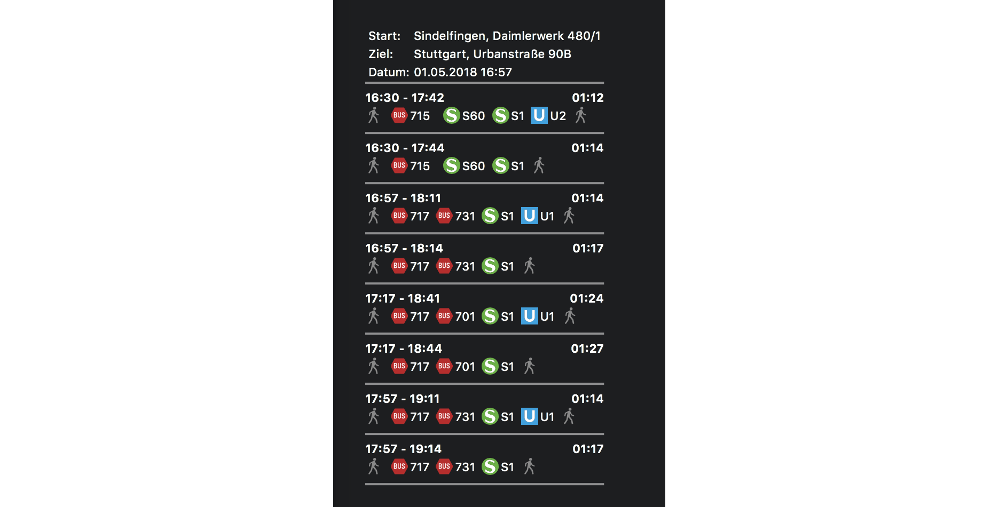
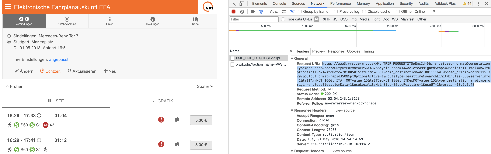

# Übersicht | Commute Widget

Displays the next connection for a defined journey inside the public transportation of Stuttgart, Germany (VVS).

To get details of a specific journey you can click (with "Interaction Shortcut" in Übersicht Preferences; e.g. CMD+Click) on the corresponding line.

## Configuration

### Origin and destination
The origin and destination of the journey can be configured in `lib/efa.js`.

To find out which strings match which location, you can use the [Elektronische Fahrplanauskunft](https://www3.vvs.de/). Open the Chrome Developer Panel (or the one of your favorite browser). Search for your origin and destination on the page. Once you hit the "Anfordern"-Button, you can lookup the request url in the network panel.

The fields `name_origin` and `name_destination` need to be copied to the regarding variable in `lib/efa.js`.

### Proxy settings

Further, if you're behind a proxy, you can configure the proxy also in `lib/efa.js`. See `options.host` and `options.port`.

**NOTE:** The widget will first try to reach the API through the proxy. If the connection fails, the widget will try the query again without proxy.
